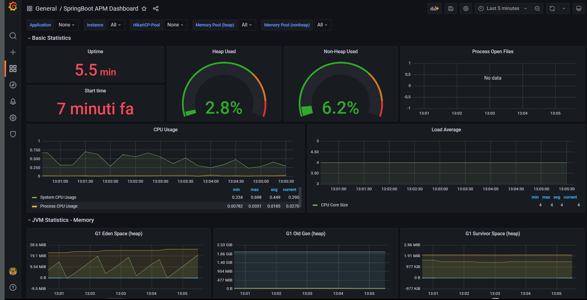
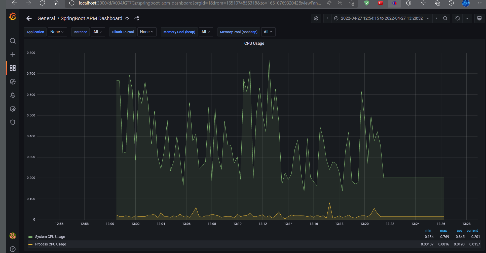

<div align="center">
  
</div>

  <div align="right">
    
    
    
    
	 
	  
    
     
     
	 
	  
	
	   
  </div>

<br>

<br>


<div align="right"> 
  <a href="./assets/translation/README.es.md">
    
  </a> 
  <a href="./README.md">
    
  </a> 
</div>

<br>

<br>

<div align="center">

# Real Estate Microservices 

</div>

Implementation of Microservices for real estate with Spring Boot, Spring Cloud, Spring Data JPA, Resilience4J, Grafana, Prometheus, Lombok, Maven, Postman, RESTful API, Postgres, MySQL and other Technologies.

<br>

* [Postgres real estate database repository](https://github.com/andresWeitzel/db_inmobiliaria_microservicios_postgres)
* [MySQL property inspections database repository](https://github.com/andresWeitzel/db_inspecciones_inmuebles_microservicios_mysql)
* [Functional Playlist](https://www.youtube.com/playlist?list=PLCl11UFjHurC0zJPiNF-rCbAFd2BGUBOe) <a href="https://www.youtube.com/playlist?list=PLCl11UFjHurC0zJPiNF-rCbAFd2BGUBOe" target="_blank"> </a>
 


<br>

## Index 📜 

<details>
 <summary> View </summary>
 
 <br>
 
 
### Section 1) Description, Technologies and Dependencies 
 
 - [1.0) Project Description.](#10-project-description-)
 - [1.1) Design Patterns.](#11-design-patterns-)
 - [1.2) Technologies.](#12-technologies-)
     - [1.2.1) Downloads.](#121-downloads)
 - [1.3) Maven Dependencies.](#13-maven-dependencies-)
 
### Section 2) Endpoints and Resources 
 
 - [2.0) EndPoints.](#endpoints-)
 - [2.1) Resources by Endpoints.](#graphical-documentation-of-resources-by-endpoints-swagger-ui-)
 - [2.2) Request and Response Examples.](#22-request-and-response-examples-)
 
 
### Section 3) Functionality Testing and References
 
 - [3.0) Functionality Testing.](#30-functionality-testing-)
 - [1.1) References.](#31-references-)
	
### Section 4) Creation and Configuration of the InmuebleService Microservice Model from scratch
 
 - [4.0) InmuebleService Microservice Model.](#40-inmuebleservice-microservice-model-)
     - [4.0.0) Creation and Configuration.](#400-creation-and-configuration)
     - [4.0.1) Enums.](#401-enums)
     - [4.0.2) Entities.](#402-entities)
     - [4.0.3) Interfaces.](#403-interfaces)
     - [4.0.4) Services.](#404-services)
     - [4.0.5) Value Objects.](#405-value-objects)
     - [4.0.6) Template Value Objects.](#406-template-value-objects)
     - [4.0.7) Controllers.](#407-controllers)
- [4.1) Database configuration.](#41-database-configuration-)
- [4.2) application.properties configuration.](#42-application-properties-configuration)
- [4.3) PostgreSQL management from cmd.](#43-postgresql-management-from-cmd)
- [4.4) Functionality testing.](#44-functionality-testing)

### Section 5) Git usage and management

- [5.0) Download.](#50-download-)
- [5.1) Upload project to remote repository.](#51-upload-project-to-remote-repository-)
- [5.2) Project repository update.](#52-project-repository-update-)
 
	
	
</details>


<br>

## Section 1) Description, Technologies and Dependencies 


### 1.0) Project Description [🔝](#index-) 

<details>
 <summary>View</summary>
 
 <br>

* This project was created to put into practice the interrelation and operation of several Microservices with different DBMS such as MySQL and PostgreSQL.
* The `PropietarioInmuebleService` and `InmuebleService` Microservices implement the same PostgreSQL DBMS database for a real estate company.
* The `InspeccionInmuebleService` Microservice will communicate with a MySQL database for the validation and control of the properties.
* The Generic Management Service for Microservices will be `EurekaService`, this will not implement any database as it will be responsible for all the management and Control of the rest of the Microservices and Services.
* The `API Gateway` Service will be in charge of managing the rest of the 3 microservices of the application, it is interconnected through the Circuit Breaker Design Pattern for Exception Control, Fault Tolerance, etc. All microservice resources go through the port and address of this service.
* The `ResilienceFourJ` Service will be in charge of directly handling Exception Control, Errors, etc. that may occur, just like the API Gateway handles the Circuit Breaker pattern, in addition, for each resource of each microservice, the modules of said pattern are implemented.
* ResilienceFourJ is directly configured to work with `Prometheus` and `Grafana`. Prometheus will handle all the ResilienceFourJ information and Grafana will deploy this information in a Dashboard-type Graphical environment.


* The Project consists of 3 REST microservices and 3 management, administration and security services for the microservices

``` Microservices
|  |  |--------> Rest Microservice InmuebleService ----------------> db_inmobiliaria_microservicios  		--> (Postgres) --> (shared) 
|  |-----------> Rest Microservice PropietarioInmuebleService------> db_inmobiliaria_microservicios  		--> (Postgres) --> (shared) 
|--------------> Rest Microservice InspeccionInmuebleService-------> db_inspecciones_inmuebles_microservicios   --> (Mysql)    --> (unique)  
```

```
Services
|  |  |  |-----> EurekaService -----------> Microservices Management Server
|  |  |--------> ApiGatewayService -------> Proxy with load balancing for microservice request management 
|  |-----------> ResilienceFourJService --> Service for Exception Control and Fault Tolerance. Circuit Breaker Pattern
| |------------> Prometheus/Actuator Service -----> Handling of ResilienceFourJ data
|--------------> Grafana Dashboard Service -------> Deployment of data transferred by Prometheus
```
 
 <br>

* [Postgres real estate database repository](https://github.com/andresWeitzel/db_inmobiliaria_microservicios_postgres)
* [MySQL property inspections database repository](https://github.com/andresWeitzel/db_inspecciones_inmuebles_microservicios_mysql)
* [Project PlayList](https://www.youtube.com/playlist?list=PLCl11UFjHurC0zJPiNF-rCbAFd2BGUBOe)
 
<br>

</details>


### 1.1) Design Patterns [🔝](#index-)

<details>
 <summary>View</summary>
 
 <br>

| **Design Pattern** | **Purpose** |               
| ------------- | ------------- |
| DAO | Use of interfaces and repositories for data persistence and storage. |
| MVC | Separation and Representation of Data, Error handling, Scalability, etc  |
| VO  | Value Object pattern for Object relationship through Templates of each Microservice |
| DTO  | Pattern for the Use of POJO Objects for data transfer between Microservices and Resilience4J |
| Circuit Breaker | Pattern for Exception Control and Handling along with Fault Tolerance |

<br>

</details>


### 1.2) Technologies [🔝](#index-)

<details>
 <summary>View</summary>
 
 <br>

| **Technologies** | **Version** | **Purpose** |           
| ------------- | ------------- | ------------- |
| [Java](https://docs.oracle.com/en/) |  12.0.2 | JDK |
| [Spring Tool Suite 4](https://spring.io/blog/2021/06/21/spring-tools-4-11-0-released) | 4.9.0  | IDE |
| [Spring Boot](https://spring.io/) |  2.6.4  | Framework |
| [Spring Boot Data JPA](https://spring.io/projects/spring-data-jpa)  | 2.6.3 | Object mapping and database persistence |
| [Spring Validation](https://www.baeldung.com/spring-boot-bean-validation)  | 2.7 | Annotations for Validations |
| [Eureka Server and Client](https://cloud.spring.io/spring-cloud-netflix/multi/multi_spring-cloud-eureka-server.html) | 3.1.1 | Microservices Administration |
| [Api-Gateway](https://www.baeldung.com/spring-cloud-gateway) | 3.1.1 | Proxy Resource Management |
| [Resilience4J](https://resilience4j.readme.io/docs) | 3.1.1 | Circuit Breaker Pattern Utilization |

<br>

</details>


### 1.2.1) Downloads [🔝](#index-)

<details>
 <summary>View</summary>
 
 <br>

* [Java-JDK 12](https://www.oracle.com/java/technologies/javase/jdk12-archive-downloads.html)
* [Spring Tool Suite 4](https://spring.io/tools)
* [Prometheus](https://prometheus.io/download/)
* [Grafana](https://grafana.com/grafana/download?platform=windows)
* [Dbeaver](https://dbeaver.io/download/)
* [PostgreSQL](https://www.postgresql.org/download/)
* [MySQL](https://www.mysql.com/it/)	
* [Xampp](https://www.apachefriends.org/download.html)
* [Lombok](https://projectlombok.org/download)
* [Open UI](https://open-ui.org/)
* [Postman](https://www.postman.com/downloads/)
* [MongoDB](https://www.mongodb.com/try/download/community)
* [MongoDB Compass](https://www.mongodb.com/try/download/compass)
* [Git](https://git-scm.com/downloads)

<br>

</details>


### 1.3) Maven Dependencies [🔝](#index-)

<details>
 <summary>View</summary>
 
 <br>

| **Maven Dependency**  | **Version** | **Purpose** |             
| ------------- | ------------- | ------------- |
| mysql-connector | 8.0.21 |  Connection to MySQL DB |
| postgresql-connector | 42.3.1 | Connection to PostgreSQL DB  | 
| lombok | 1.18.22 |  Dependency for code automation |
| spring-boot-starter-test | 2.6.4 | Testing usage |
| spring-boot-starter-data-jpa | 2.6.4 | JpaRepository API for method handling | 
| spring-boot-starter-devtools | 2.6.6 | Tool for runtime recompilation |
| spring-boot-starter-web | 2.6.4 | Automatic web configuration for Maven to Spring |
| spring-boot-starter-actuator | 2.6.6 | Api Rest monitoring and management |
| spring-boot-starter-aop | 2.6.6 | Api Rest modularity |
| spring-cloud-starter-netflix-eureka-client | 3.1.1 | Connection to Eureka Service |
| spring-cloud-starter-netflix-eureka-server | 3.1.1 | Dependencies for Eureka Service |
| spring-cloud-starter-gateway | 3.1.1 | Proxy Resource Management |
| spring-cloud-starter-bootstrap | 3.1.1 | Server Configuration Preparation |
| spring-cloud-starter-config | 3.1.1 | Allows externalizing and centralizing microservice configuration in one place |
| spring-cloud-starter-circuitbreaker-resilience4j | 2.1.1 | Dependency for Circ Break and Resiliency usage | 

| **Maven Dependency Manager**  | **Version** | **Purpose** |             
| ------------- | ------------- | ------------- |
| spring-cloud-dependencies | 2021.0.0 | Cloud Dependencies Manager |


<br>

</details>


<br>

## Section 2) EndPoints and Resources

### 2.0) EndPoints [🔝](#index-)

<details>
 <summary>View</summary>
 
### Default MicroServices EndPoints:
* http://localhost:8092/v1/inmuebles/
* http://localhost:8093/v1/propietarios-inmuebles/
* http://localhost:8095/v1/inspecciones-inmuebles/

### MicroServices EndPoints with Api Gateway:
* http://localhost:9191/v1/inmuebles/
* http://localhost:9191/v1/propietarios-inmuebles/
* http://localhost:9191/v1/inspecciones-inmuebles/

### MicroServices EndPoints with Resilience4J
* http://localhost:9295/v1/inmueble-service
* http://localhost:9295/v1/propietario-inmueble-service/
* http://localhost:9295/v1/inspeccion-inmueble-service/

### Analytical Endpoint with Prometheus
* http://localhost:9295/actuator/prometheus

### Deploy Endpoint with Grafana (username:admin password:admin)
* http://localhost:3000/d/X034JGT7Gz/springboot-apm-dashboard?orgId=1&from=now-1m&to=now
  

<br>

</details>


### 2.1) Resources by Endpoints. (Swagger UI) [🔝](#index-)

<details>
 <summary>View</summary>

### Services in Spring Cloud Eureka Server


### MicroServices by host and port independently


### Initial Load of Resources via Grafana


### GET Test Microservices port Resilience with Postman


### Http Methods GET Statistics in Grafana


### POST Test Microservices port Resilience with Postman


### Http Methods POST Statistics in Grafana


### Load after consuming Resources via Grafana

	
### CPU Usage of the System after consuming Resources via Grafana


 
 <br>

</details>

### 2.2) Request and Response Examples [🔝](#index-)

<details>
 <summary>View</summary>

## Microservice InmuebleService

### 2.2.1) POST Operations

#### Create Inmueble

###### Request (POST)

**Method:** POST  
**URL:** `http://localhost:8092/v1/inmuebles/`  
**Headers:**  
- Content-Type: application/json

**Body (raw JSON):**
```json
{
    "idPropInm": "550e8400-e29b-41d4-a716-446655440000",
    "descr": "Departamento de 2 ambientes con balcón",
    "tipo": "Departamento",
    "estadoInm": "DISPONIBLE",
    "precInmUsd": 150000.0,
    "direc": "Av. Corrientes 1234",
    "ubic": "Palermo",
    "sitWeb": "www.inmobiliaria.com"
}
```

###### Response (200 OK)

```json
{
    "id": "550e8400-e29b-41d4-a716-446655440001",
    "idPropInm": "550e8400-e29b-41d4-a716-446655440000",
    "descr": "Departamento de 2 ambientes con balcón",
    "tipo": "Departamento",
    "estadoInm": "DISPONIBLE",
    "precInmUsd": 150000.0,
    "direc": "Av. Corrientes 1234",
    "ubic": "Palermo",
    "sitWeb": "www.inmobiliaria.com"
}
```

###### Response (422 Unprocessable Entity)

```json
{
    "message": "No se ha Insertado el Inmueble en la Base de Datos"
}
```

### 2.2.2) GET Operations

#### Get All Inmuebles (Paginated)

###### Request (GET)

**Method:** GET  
**URL:** `http://localhost:8092/v1/inmuebles/listado?page=0&size=5&sort=id,desc`  
**Headers:**  
- Content-Type: application/json

###### Response (200 OK)

```json
{
    "content": [
        {
            "id": "550e8400-e29b-41d4-a716-446655440001",
            "idPropInm": "550e8400-e29b-41d4-a716-446655440000",
            "descr": "Departamento de 2 ambientes con balcón",
            "tipo": "Departamento",
            "estadoInm": "DISPONIBLE",
            "precInmUsd": 150000.0,
            "direc": "Av. Corrientes 1234",
            "ubic": "Palermo",
            "sitWeb": "www.inmobiliaria.com"
        }
    ],
    "pageable": {
        "sort": {
            "sorted": true,
            "unsorted": false
        },
        "pageNumber": 0,
        "pageSize": 5,
        "offset": 0,
        "paged": true,
        "unpaged": false
    },
    "totalElements": 1,
    "totalPages": 1,
    "last": true,
    "first": true,
    "sort": {
        "sorted": true,
        "unsorted": false
    },
    "numberOfElements": 1,
    "size": 5,
    "number": 0
}
```

#### Get Inmueble by ID

###### Request (GET)

**Method:** GET  
**URL:** `http://localhost:8092/v1/inmuebles/id/550e8400-e29b-41d4-a716-446655440001`  
**Headers:**  
- Content-Type: application/json

###### Response (200 OK)

```json
{
    "id": "550e8400-e29b-41d4-a716-446655440001",
    "idPropInm": "550e8400-e29b-41d4-a716-446655440000",
    "descr": "Departamento de 2 ambientes con balcón",
    "tipo": "Departamento",
    "estadoInm": "DISPONIBLE",
    "precInmUsd": 150000.0,
    "direc": "Av. Corrientes 1234",
    "ubic": "Palermo",
    "sitWeb": "www.inmobiliaria.com"
}
```

#### Get Inmuebles by Propietario ID

###### Request (GET)

**Method:** GET  
**URL:** `http://localhost:8092/v1/inmuebles/id-propietario-inmueble/550e8400-e29b-41d4-a716-446655440000?page=0&size=10`  
**Headers:**  
- Content-Type: application/json

###### Response (200 OK)

```json
{
    "content": [
        {
            "id": "550e8400-e29b-41d4-a716-446655440001",
            "idPropInm": "550e8400-e29b-41d4-a716-446655440000",
            "descr": "Departamento de 2 ambientes con balcón",
            "tipo": "Departamento",
            "estadoInm": "DISPONIBLE",
            "precInmUsd": 150000.0,
            "direc": "Av. Corrientes 1234",
            "ubic": "Palermo",
            "sitWeb": "www.inmobiliaria.com"
        }
    ],
    "totalElements": 1,
    "totalPages": 1
}
```

#### Get Inmueble with Propietario Template

###### Request (GET)

**Method:** GET  
**URL:** `http://localhost:8092/v1/inmuebles/inmueble-con-propietario-inmueble/id-inm/550e8400-e29b-41d4-a716-446655440001`  
**Headers:**  
- Content-Type: application/json

###### Response (200 OK)

```json
{
    "propietarioInmuebleVO": {
        "id": "550e8400-e29b-41d4-a716-446655440000",
        "nombre": "Juan",
        "apellido": "Pérez",
        "edad": 35,
        "fechaNac": "1988-05-15",
        "tipoDoc": "DNI",
        "nroDoc": "12345678",
        "direc": "Av. Libertador 1000",
        "nroTelPrinc": "11-1234-5678",
        "nroTelSec": "11-8765-4321",
        "email": "juan.perez@email.com"
    },
    "inmueble": {
        "id": "550e8400-e29b-41d4-a716-446655440001",
        "idPropInm": "550e8400-e29b-41d4-a716-446655440000",
        "descr": "Departamento de 2 ambientes con balcón",
        "tipo": "Departamento",
        "estadoInm": "DISPONIBLE",
        "precInmUsd": 150000.0,
        "direc": "Av. Corrientes 1234",
        "ubic": "Palermo",
        "sitWeb": "www.inmobiliaria.com"
    }
}
```

### 2.2.3) PUT Operations

#### Update Inmueble

###### Request (PUT)

**Method:** PUT  
**URL:** `http://localhost:8092/v1/inmuebles/`  
**Headers:**  
- Content-Type: application/json

**Body (raw JSON):**
```json
{
    "id": "550e8400-e29b-41d4-a716-446655440001",
    "idPropInm": "550e8400-e29b-41d4-a716-446655440000",
    "descr": "Departamento de 2 ambientes con balcón y terraza",
    "tipo": "Departamento",
    "estadoInm": "VENDIDO",
    "precInmUsd": 160000.0,
    "direc": "Av. Corrientes 1234",
    "ubic": "Palermo",
    "sitWeb": "www.inmobiliaria.com"
}
```

###### Response (200 OK)

```json
{
    "id": "550e8400-e29b-41d4-a716-446655440001",
    "idPropInm": "550e8400-e29b-41d4-a716-446655440000",
    "descr": "Departamento de 2 ambientes con balcón y terraza",
    "tipo": "Departamento",
    "estadoInm": "VENDIDO",
    "precInmUsd": 160000.0,
    "direc": "Av. Corrientes 1234",
    "ubic": "Palermo",
    "sitWeb": "www.inmobiliaria.com"
}
```

### 2.2.4) DELETE Operations

#### Delete Inmueble

###### Request (DELETE)

**Method:** DELETE  
**URL:** `http://localhost:8092/v1/inmuebles/550e8400-e29b-41d4-a716-446655440001`  
**Headers:**  
- Content-Type: application/json

###### Response (200 OK)

```json
{
    "message": "Se ha Eliminado el Inmueble de la Base de Datos"
}
```

---

## Microservice PropietarioInmuebleService

### 2.2.5) POST Operations

#### Create Propietario Inmueble

###### Request (POST)

**Method:** POST  
**URL:** `http://localhost:8093/v1/propietarios-inmuebles/`  
**Headers:**  
- Content-Type: application/json

**Body (raw JSON):**
```json
{
    "nombre": "María",
    "apellido": "González",
    "edad": 42,
    "fechaNac": "1981-03-20",
    "tipoDoc": "DNI",
    "nroDoc": "87654321",
    "direc": "Av. Santa Fe 2000",
    "nroTelPrinc": "11-9876-5432",
    "nroTelSec": "11-1111-2222",
    "email": "maria.gonzalez@email.com"
}
```

###### Response (200 OK)

```json
{
    "id": "550e8400-e29b-41d4-a716-446655440002",
    "nombre": "María",
    "apellido": "González",
    "edad": 42,
    "fechaNac": "1981-03-20",
    "tipoDoc": "DNI",
    "nroDoc": "87654321",
    "direc": "Av. Santa Fe 2000",
    "nroTelPrinc": "11-9876-5432",
    "nroTelSec": "11-1111-2222",
    "email": "maria.gonzalez@email.com"
}
```

### 2.2.6) GET Operations

#### Get All Propietarios (Paginated)

###### Request (GET)

**Method:** GET  
**URL:** `http://localhost:8093/v1/propietarios-inmuebles/listado?page=0&size=5&sort=apellido,asc`  
**Headers:**  
- Content-Type: application/json

###### Response (200 OK)

```json
{
    "content": [
        {
            "id": "550e8400-e29b-41d4-a716-446655440000",
            "nombre": "Juan",
            "apellido": "Pérez",
            "edad": 35,
            "fechaNac": "1988-05-15",
            "tipoDoc": "DNI",
            "nroDoc": "12345678",
            "direc": "Av. Libertador 1000",
            "nroTelPrinc": "11-1234-5678",
            "nroTelSec": "11-8765-4321",
            "email": "juan.perez@email.com"
        },
        {
            "id": "550e8400-e29b-41d4-a716-446655440002",
            "nombre": "María",
            "apellido": "González",
            "edad": 42,
            "fechaNac": "1981-03-20",
            "tipoDoc": "DNI",
            "nroDoc": "87654321",
            "direc": "Av. Santa Fe 2000",
            "nroTelPrinc": "11-9876-5432",
            "nroTelSec": "11-1111-2222",
            "email": "maria.gonzalez@email.com"
        }
    ],
    "totalElements": 2,
    "totalPages": 1
}
```

#### Get Propietario by ID

###### Request (GET)

**Method:** GET  
**URL:** `http://localhost:8093/v1/propietarios-inmuebles/id/550e8400-e29b-41d4-a716-446655440000`  
**Headers:**  
- Content-Type: application/json

###### Response (200 OK)

```json
{
    "id": "550e8400-e29b-41d4-a716-446655440000",
    "nombre": "Juan",
    "apellido": "Pérez",
    "edad": 35,
    "fechaNac": "1988-05-15",
    "tipoDoc": "DNI",
    "nroDoc": "12345678",
    "direc": "Av. Libertador 1000",
    "nroTelPrinc": "11-1234-5678",
    "nroTelSec": "11-8765-4321",
    "email": "juan.perez@email.com"
}
```

#### Get Propietarios by Nombre

###### Request (GET)

**Method:** GET  
**URL:** `http://localhost:8093/v1/propietarios-inmuebles/nombre/Juan?page=0&size=10`  
**Headers:**  
- Content-Type: application/json

###### Response (200 OK)

```json
{
    "content": [
        {
            "id": "550e8400-e29b-41d4-a716-446655440000",
            "nombre": "Juan",
            "apellido": "Pérez",
            "edad": 35,
            "fechaNac": "1988-05-15",
            "tipoDoc": "DNI",
            "nroDoc": "12345678",
            "direc": "Av. Libertador 1000",
            "nroTelPrinc": "11-1234-5678",
            "nroTelSec": "11-8765-4321",
            "email": "juan.perez@email.com"
        }
    ],
    "totalElements": 1,
    "totalPages": 1
}
```

### 2.2.7) PUT Operations

#### Update Propietario Inmueble

###### Request (PUT)

**Method:** PUT  
**URL:** `http://localhost:8093/v1/propietarios-inmuebles/`  
**Headers:**  
- Content-Type: application/json

**Body (raw JSON):**
```json
{
    "id": "550e8400-e29b-41d4-a716-446655440000",
    "nombre": "Juan Carlos",
    "apellido": "Pérez",
    "edad": 36,
    "fechaNac": "1988-05-15",
    "tipoDoc": "DNI",
    "nroDoc": "12345678",
    "direc": "Av. Libertador 1500",
    "nroTelPrinc": "11-1234-5678",
    "nroTelSec": "11-8765-4321",
    "email": "juan.perez@email.com"
}
```

###### Response (200 OK)

```json
{
    "id": "550e8400-e29b-41d4-a716-446655440000",
    "nombre": "Juan Carlos",
    "apellido": "Pérez",
    "edad": 36,
    "fechaNac": "1988-05-15",
    "tipoDoc": "DNI",
    "nroDoc": "12345678",
    "direc": "Av. Libertador 1500",
    "nroTelPrinc": "11-1234-5678",
    "nroTelSec": "11-8765-4321",
    "email": "juan.perez@email.com"
}
```

### 2.2.8) DELETE Operations

#### Delete Propietario Inmueble

###### Request (DELETE)

**Method:** DELETE  
**URL:** `http://localhost:8093/v1/propietarios-inmuebles/550e8400-e29b-41d4-a716-446655440000`  
**Headers:**  
- Content-Type: application/json

###### Response (200 OK)

```json
{
    "message": "Se ha Eliminado el Propietario del Inmueble de la Base de Datos"
}
```

---

## Microservice InspeccionInmuebleService

### 2.2.9) POST Operations

#### Create Inspeccion Inmueble

###### Request (POST)

**Method:** POST  
**URL:** `http://localhost:8095/v1/inspecciones-inmuebles/`  
**Headers:**  
- Content-Type: application/json

**Body (raw JSON):**
```json
{
    "idInm": "550e8400-e29b-41d4-a716-446655440001",
    "estadoInsp": "PENDIENTE",
    "tipoInsp": "ESTRUCTURAL",
    "descrInsp": "Inspección estructural completa del edificio",
    "empresa": "Inspecciones S.A.",
    "direc": "Av. Corrientes 1234",
    "nroTel": "11-5555-6666",
    "costo": 500.0,
    "fecha": "2024-01-15",
    "hora": "14:30:00"
}
```

###### Response (200 OK)

```json
{
    "id": "550e8400-e29b-41d4-a716-446655440003",
    "idInm": "550e8400-e29b-41d4-a716-446655440001",
    "estadoInsp": "PENDIENTE",
    "tipoInsp": "ESTRUCTURAL",
    "descrInsp": "Inspección estructural completa del edificio",
    "empresa": "Inspecciones S.A.",
    "direc": "Av. Corrientes 1234",
    "nroTel": "11-5555-6666",
    "costo": 500.0,
    "fecha": "2024-01-15",
    "hora": "14:30:00"
}
```

### 2.2.10) GET Operations

#### Get All Inspecciones (Paginated)

###### Request (GET)

**Method:** GET  
**URL:** `http://localhost:8095/v1/inspecciones-inmuebles/listado?page=0&size=5&sort=fecha,desc`  
**Headers:**  
- Content-Type: application/json

###### Response (200 OK)

```json
{
    "content": [
        {
            "id": "550e8400-e29b-41d4-a716-446655440003",
            "idInm": "550e8400-e29b-41d4-a716-446655440001",
            "estadoInsp": "PENDIENTE",
            "tipoInsp": "ESTRUCTURAL",
            "descrInsp": "Inspección estructural completa del edificio",
            "empresa": "Inspecciones S.A.",
            "direc": "Av. Corrientes 1234",
            "nroTel": "11-5555-6666",
            "costo": 500.0,
            "fecha": "2024-01-15",
            "hora": "14:30:00"
        }
    ],
    "totalElements": 1,
    "totalPages": 1
}
```

#### Get Inspeccion by ID

###### Request (GET)

**Method:** GET  
**URL:** `http://localhost:8095/v1/inspecciones-inmuebles/id/550e8400-e29b-41d4-a716-446655440003`  
**Headers:**  
- Content-Type: application/json

###### Response (200 OK)

```json
{
    "id": "550e8400-e29b-41d4-a716-446655440003",
    "idInm": "550e8400-e29b-41d4-a716-446655440001",
    "estadoInsp": "PENDIENTE",
    "tipoInsp": "ESTRUCTURAL",
    "descrInsp": "Inspección estructural completa del edificio",
    "empresa": "Inspecciones S.A.",
    "direc": "Av. Corrientes 1234",
    "nroTel": "11-5555-6666",
    "costo": 500.0,
    "fecha": "2024-01-15",
    "hora": "14:30:00"
}
```

#### Get Inspeccion with Inmueble Template

###### Request (GET)

**Method:** GET  
**URL:** `http://localhost:8095/v1/inspecciones-inmuebles/inspeccion-inmueble-con-inmueble/id-inmueble/550e8400-e29b-41d4-a716-446655440001`  
**Headers:**  
- Content-Type: application/json

###### Response (200 OK)

```json
{
    "inspeccionInmuebleEntity": {
        "id": "550e8400-e29b-41d4-a716-446655440003",
        "idInm": "550e8400-e29b-41d4-a716-446655440001",
        "estadoInsp": "PENDIENTE",
        "tipoInsp": "ESTRUCTURAL",
        "descrInsp": "Inspección estructural completa del edificio",
        "empresa": "Inspecciones S.A.",
        "direc": "Av. Corrientes 1234",
        "nroTel": "11-5555-6666",
        "costo": 500.0,
        "fecha": "2024-01-15",
        "hora": "14:30:00"
    },
    "inmuebleVO": {
        "id": "550e8400-e29b-41d4-a716-446655440001",
        "idPropInm": "550e8400-e29b-41d4-a716-446655440000",
        "descr": "Departamento de 2 ambientes con balcón",
        "tipo": "Departamento",
        "estadoInm": "DISPONIBLE",
        "precioInmUsd": 150000.0,
        "direc": "Av. Corrientes 1234",
        "ubic": "Palermo",
        "sitWeb": "www.inmobiliaria.com"
    }
}
```

### 2.2.11) PUT Operations

#### Update Inspeccion Inmueble

###### Request (PUT)

**Method:** PUT  
**URL:** `http://localhost:8095/v1/inspecciones-inmuebles/`  
**Headers:**  
- Content-Type: application/json

**Body (raw JSON):**
```json
{
    "id": "550e8400-e29b-41d4-a716-446655440003",
    "idInm": "550e8400-e29b-41d4-a716-446655440001",
    "estadoInsp": "COMPLETADA",
    "tipoInsp": "ESTRUCTURAL",
    "descrInsp": "Inspección estructural completa del edificio - APROBADA",
    "empresa": "Inspecciones S.A.",
    "direc": "Av. Corrientes 1234",
    "nroTel": "11-5555-6666",
    "costo": 500.0,
    "fecha": "2024-01-15",
    "hora": "14:30:00"
}
```

###### Response (200 OK)

```json
{
    "id": "550e8400-e29b-41d4-a716-446655440003",
    "idInm": "550e8400-e29b-41d4-a716-446655440001",
    "estadoInsp": "COMPLETADA",
    "tipoInsp": "ESTRUCTURAL",
    "descrInsp": "Inspección estructural completa del edificio - APROBADA",
    "empresa": "Inspecciones S.A.",
    "direc": "Av. Corrientes 1234",
    "nroTel": "11-5555-6666",
    "costo": 500.0,
    "fecha": "2024-01-15",
    "hora": "14:30:00"
}
```

### 2.2.12) DELETE Operations

#### Delete Inspeccion Inmueble

###### Request (DELETE)

**Method:** DELETE  
**URL:** `http://localhost:8095/v1/inspecciones-inmuebles/550e8400-e29b-41d4-a716-446655440003`  
**Headers:**  
- Content-Type: application/json

###### Response (200 OK)

```json
{
    "message": "Se ha Eliminado la Inspección del Inmueble de la Base de datos"
}
```

---

## Microservices with API Gateway

### 2.2.13) API Gateway Endpoints

#### Get All Inmuebles through Gateway

###### Request (GET)

**Method:** GET  
**URL:** `http://localhost:9191/v1/inmuebles/listado?page=0&size=5`  
**Headers:**  
- Content-Type: application/json

#### Get All Propietarios through Gateway

###### Request (GET)

**Method:** GET  
**URL:** `http://localhost:9191/v1/propietarios-inmuebles/listado?page=0&size=5`  
**Headers:**  
- Content-Type: application/json

#### Get All Inspecciones through Gateway

###### Request (GET)

**Method:** GET  
**URL:** `http://localhost:9191/v1/inspecciones-inmuebles/listado?page=0&size=5`  
**Headers:**  
- Content-Type: application/json

---

## Microservices with Resilience4J

### 2.2.14) Resilience4J Endpoints

#### Get All Inmuebles through Resilience4J

###### Request (GET)

**Method:** GET  
**URL:** `http://localhost:9295/v1/inmueble-service/listado`  
**Headers:**  
- Content-Type: application/json

#### Get All Propietarios through Resilience4J

###### Request (GET)

**Method:** GET  
**URL:** `http://localhost:9295/v1/propietario-inmueble-service/listado`  
**Headers:**  
- Content-Type: application/json

#### Get All Inspecciones through Resilience4J

###### Request (GET)

**Method:** GET  
**URL:** `http://localhost:9295/v1/inspeccion-inmueble-service/listado`  
**Headers:**  
- Content-Type: application/json

---

## Error Responses

### 2.2.15) Common Error Responses

#### 422 Unprocessable Entity

```json
{
    "message": "No se ha Insertado el Inmueble en la Base de Datos"
}
```

#### 404 Not Found

```json
{
    "message": "Resource not found"
}
```

#### 500 Internal Server Error

```json
{
    "message": "Internal server error occurred"
}
```

<br>

</details>


<br>

<br>

## Section 3) Functionality Testing and References


### 3.0) Functionality Testing [🔝](#index-)

<details>
 <summary>View</summary>


### REST APIs Default Microservices

* [Inmueble Service Microservice](https://www.youtube.com/watch?v=dpEpQqyBTEw&list=PLCl11UFjHurC0zJPiNF-rCbAFd2BGUBOe&index=1)

* [Propietario Inmueble Service Microservice](https://www.youtube.com/watch?v=ahi5WDX19rQ&list=PLCl11UFjHurC0zJPiNF-rCbAFd2BGUBOe&index=2)

* [Inspeccion Inmueble Service Microservice](https://www.youtube.com/watch?v=6KeUPebnKu8&list=PLCl11UFjHurC0zJPiNF-rCbAFd2BGUBOe&index=3&t=2s)

</br>

###  REST APIs Microservices with API Gateway

* [Microservices](https://www.youtube.com/watch?v=kkjxv7HMlNI&list=PLCl11UFjHurC0zJPiNF-rCbAFd2BGUBOe&index=4)

</br>

### REST APIs Microservices with Resilience4J

* [Inmueble-Service Resilience Microservice](https://www.youtube.com/watch?v=9OEwhURfrXw&list=PLCl11UFjHurC0zJPiNF-rCbAFd2BGUBOe&index=6&t=214s)

* [Propietario-Inmueble-Service and Inspección-Inmueble-Service Resilience Microservices](https://www.youtube.com/watch?v=mn-jAeEwt-8&list=PLCl11UFjHurC0zJPiNF-rCbAFd2BGUBOe&index=6)

</br>

### Microservices Data Analytics Deployment with Grafana and Prometheus 

* [HTTP Requests Analysis](https://www.youtube.com/watch?v=9TxvWcXT-JM&list=PLCl11UFjHurC0zJPiNF-rCbAFd2BGUBOe&index=7)	
	
 <br>

</details>


### 3.1) References [🔝](#index-)

<details>
 <summary>View</summary>
	
### Recommended Unofficial Documentation

* [Microservices Structuring and Creation](https://www.youtube.com/watch?v=BnknNTN8icw&t=5s)
* [Resilience4j Development](https://www.youtube.com/watch?v=Z_viIJSGXJw&list=PLq3uEqRnr_2GlhVSqltfLtpO8GF4VIICY&index=1)
* [Grafana Dashboard Setup](https://www.youtube.com/watch?v=4WWW2ZLEg74)
* [Grafana Dashboard Setup/Config](https://www.youtube.com/watch?v=zTZe447nDhI)

 <br>

</details>


<br>

## Section 4) Creation and Configuration of the InmuebleService Microservice Model from scratch


### 4.0) InmuebleService Microservice Model [🔝](#index-)

<details>
 <summary>View</summary>

#### 4.0.0) Creation and Configuration
#### (Only code relevant to microservices will be explained and included, all explanations and steps from scratch for a REST API are included in another project..https://github.com/andresWeitzel/Api_Rest_Spring_Productos)


* We create and configure a Spring Started Proyect ( Name: InmuebleService | Group: com.inmueble.service | Package : com.inmueble.service )
* From the project configuration, we add the spring web, spring data jpa, postgresql driver and Lombok dependencies

```xml
<dependency>
			<groupId>org.springframework.boot</groupId>
			<artifactId>spring-boot-starter-data-jpa</artifactId>
		</dependency>
		<dependency>
			<groupId>org.springframework.boot</groupId>
			<artifactId>spring-boot-starter-web</artifactId>
		</dependency>

		<dependency>
			<groupId>org.postgresql</groupId>
			<artifactId>postgresql</artifactId>
			<scope>runtime</scope>
		</dependency>
		<dependency>
			<groupId>org.projectlombok</groupId>
			<artifactId>lombok</artifactId>
			<optional>true</optional>
		</dependency>
		<dependency>
			<groupId>org.springframework.boot</groupId>
			<artifactId>spring-boot-starter-test</artifactId>
			<scope>test</scope>
		</dependency>
```

</br>

#### Lombok Configuration
* After having the jars through the dependency in our project, we will install Lombok to be able to use it, it is not enough just to download, we need to configure and download it on our computer.
* We search for the jar in Maven Dependencies `lombok-1.18....` Right-click and properties
* Tab Java Source Attachment and we search for the Path where the jar of Lombok was downloaded.
* We go to that folder, in my case `C:\Users\andre\.m2\repository\org\projectlombok\lombok\1.18.22` and we execute the Lombok jar `lombok-1.18.22.jar`
* WE WILL PERFORM THE INSTALLATION IN THE CONFIGURATION FOLDER OF OUR IDE BY SELECTING SPECIFY LOCATION, IN MY CASE SPRING TOOL SUITE `C:\Program Files (x86)\sts-4.13.1.RELEASE`
* We install, next next...
* We close and reopen the IDE for the changes to take effect correctly


<br>


#### 4.0.1) Enums
#### (Only code relevant to microservices will be explained and included, all explanations and steps from scratch for a REST API are included in another project..https://github.com/andresWeitzel/Api_Rest_Spring_Productos)
* Inside the `com.inmueble.service` package hierarchy, we create the `enums` package
* We will create an enumerated class for the `estado_inmueble_enum` field of the `Inmueble` entity we will create next
* Inside the `enum` package, we create the `EstadoInmuebleEnum` class
* For this class, we do not add the @Entity annotation of JPA since we are not going to create a table in the database, but instead use the possible values of the enumerations
* We add the types of enumerations available for use from the database..
 ```java
 

 package com.inmueble.service.enums;
 


public enum EstadoInmuebleEnum {
	VENDIDO, DISPONIBLE, NO_DISPONIBLE, FALTA_INSPECCION;

}

 ```
 
 <br>


#### 4.0.2) Entities

* Inside the `com.inmueble.service` package hierarchy, we create the `entity` package
* Inside the same `Inmueble` class
* We add the corresponding annotations of the class for JPA 
* We model the inmuebles table of the db `db_inmuebles_microservicios`
* We also add the necessary annotations for the fields, subsequently `@Enumerated(EnumType.STRING)` for the enumerated. We do not add the rest of the annotations since we are going to implement Lombok
* Then we add the annotations for Lombok `@Data` , `@AllArgsConstructor` and `@NoArgsConstructor` , the first one for generating getters and setters and the rest of the methods, the second one for the overloaded constructors of the Entity and the third one for the empty constructor 

 
 ```java
package com.inmueble.service.entity;

import javax.persistence.Column;
import javax.persistence.Entity;
import javax.persistence.EnumType;
import javax.persistence.Enumerated;
import javax.persistence.GeneratedValue;
import javax.persistence.GenerationType;
import javax.persistence.Id;
import javax.persistence.Table;

import com.inmueble.service.enums.EstadoInmuebleEnum;

import lombok.AllArgsConstructor;
import lombok.Data;
import lombok.NoArgsConstructor;

@Table(name="inmuebles")
@Entity
@Data
@AllArgsConstructor
@NoArgsConstructor
public class Inmueble {
	
	
	@GeneratedValue(strategy = GenerationType.AUTO)
	@Id
	@Column(name="id")
	private int id;
	
	@Column(name="id_propietario_inmueble")
	private int idPropietarioInmueble;
	
	@Column(name="descripcion")
	private String descripcion;
	
	@Column(name="tipo")
	private String tipo;
	
	@Enumerated(EnumType.STRING)
	@Column(name="estado_inmueble")
	private EstadoInmuebleEnum  estadoInmuebleEnum;
	
	@Column(name="precio_inmueble_usd") 
	private double precioInmuebleUsd;
	
	@Column(name="direccion")
	private String direccion;
	
	@Column(name="ubicacion")
	private String ubicacion;
	
	@Column(name="sitio_web")
	private String sitioWeb;

}


 ```

 
 <br>


#### 4.0.3) Interfaces

* Inside the `com.inmueble.service` package hierarchy, we create the `repository` package
* Inside the same `I_InmuebleRepository` interface
* We add the @Repository annotation of the class for JPA and we use the `JpaRepository<InmuebleEntity, Serializable>` interface along with the Pagination `PagingAndSortingRepository<Inmueble, Long>` interface for all the functionality for creating the Jpa methods.
* We create and define all the abstract methods making reference to the tentative fields of the entity. 
* We do not create the CRUD methods in the interface, since we declare all the abstract methods without return values. The `findAll` method will be for Paginated..
 
 ```java
package com.inmueble.service.repository;

import java.io.Serializable;
import java.util.List;

import org.springframework.data.domain.Page;
import org.springframework.data.domain.Pageable;
import org.springframework.data.jpa.repository.JpaRepository;
import org.springframework.data.repository.PagingAndSortingRepository;
import org.springframework.stereotype.Repository;

import com.inmueble.service.entity.Inmueble;
import com.inmueble.service.enums.EstadoInmuebleEnum;

@Repository
public interface I_InmuebleRepository extends JpaRepository<Inmueble, Serializable>, PagingAndSortingRepository<Inmueble, Serializable> {

	
	//============================ MÉTODOS DE BÚSQUEDA ============================== 
	
	public abstract Inmueble findById(int id);
	
	public abstract List<Inmueble> findByIdPropietarioInmueble(int id);
	
	public abstract List<Inmueble> findByDescripcion(String descripcion);
	
	public abstract List<Inmueble> findByTipo(String tipo);
	
	public abstract List<Inmueble> findByEstadoInmuebleEnum(EstadoInmuebleEnum  estadoInmuebleEnum);
	
	public abstract List<Inmueble> findByPrecioInmuebleUsd(double precioInmueble);
	
	public abstract List<Inmueble> findByDireccion(String direccion);
	
	public abstract List<Inmueble> findByUbicacion(String ubicacion);
	
	public abstract List<Inmueble> findBySitioWeb(String sitioWeb);

	public abstract Page<Inmueble> findAll(Pageable pageable);
	
	
	
	

}


 ```
 
 <br>


#### 4.0.4) Services

* Inside the `com.inmueble.service` package hierarchy, we create the `service` package
* Inside the same `InmuebleService` class
* We add the @Service annotation of the class making reference to Spring and @Autowired for implementing Dependency Injection of the created interface.
* We use log4j for error logs in CRUD methods for persistence. 
* We develop the body of each method of the interface
* Each CRUD method has its persistence check and will return a boolean according to the result of the operation, they can be modified to add greater security.
 
 ```java
package com.inmueble.service.service;

import java.util.List;

import org.apache.logging.log4j.Logger;
import org.springframework.beans.factory.annotation.Autowired;
import org.springframework.data.domain.Pageable;
import org.springframework.stereotype.Service;

import com.inmueble.service.entity.Inmueble;
import com.inmueble.service.enums.EstadoInmuebleEnum;
import com.inmueble.service.repository.I_InmuebleRepository;

@Service
public class InmuebleService {
	
	@Autowired
	private I_InmuebleRepository iInmuebleRepository;
	
	
	// ============= LOGS ========================	
	private static final Logger logger = org.apache.logging.log4j.LogManager.getLogger(InmuebleService.class);

	
	// ============ MÉTODOS CRUD ==================
	
	// ----INSERT----
	public boolean addInmueble(Inmueble inmueble) {
		try {
			if(inmueble == null) {
				logger.error("ERROR addInmueble : EL INMUEBLE " + inmueble+" ES NULO!!");
				return false;
			}else {
				iInmuebleRepository.save(inmueble);
				return true;
			}
			
			
		} catch (Exception e) {
			logger.error("ERROR addInmueble : EL INMUEBLE " + inmueble+ " NO SE HA INSERTADO EN LA DB!!");
			return false;
		}
	}
	
	
	// ----UPDATE----
	public boolean updateInmueble(Inmueble inmueble) {
		try {
			if(inmueble == null) {
				logger.error("ERROR updateInmueble : EL INMUEBLE " + inmueble + " ES NULO!!");
				return false;
			}else {
				iInmuebleRepository.save(inmueble);
				return true;
			}
			
		} catch (Exception e) {
			logger.error("ERROR updateInmueble : EL INMUEBLE " + inmueble + " NO SE HA ACTUALIZADO EN LA DB!!");
			return false;
		}
	}
	
	// ----DELETE----
	public boolean deleteInmueble(int id) {
		try {
			if(id == 0) {
				logger.error("ERROR deleteInmueble : EL ID DEL INMUEBLE ES CERO!!");
				return false;
			}else {
				iInmuebleRepository.delete(iInmuebleRepository.findById(id));
				return true;
			}
			
		} catch (Exception e) {
			logger.error("ERROR deleteInmueble : EL INMUEBLE CON EL ID " + id + " NO SE HA ELIMINADO DE LA DB!!");
			return false;
		}
	}
	
	// ----SELECT----
	public List<Inmueble> getAllInmueble(Pageable pageable){
		
		return iInmuebleRepository.findAll(pageable).getContent();
	}
	
	// ============ MÉTODOS DE BÚSQUEDA ==================
	
	//----ID-----
	public Inmueble findById(int id) {
		return iInmuebleRepository.findById(id);
	}
	

	//---- ID PROPIETARIO INMUEBLE-----
	public List<Inmueble> findByIdPropietarioInmueble(int id) {
		return iInmuebleRepository.findByIdPropietarioInmueble(id);
	}
	
	
	//---- DESCRIPCION INMUEBLE-----
	public List<Inmueble> findByDescripcion(String descripcion) {
		return iInmuebleRepository.findByDescripcion(descripcion);
	}
	
	//----- TIPO DE INMUEBLE --------
	public List<Inmueble> findByTipo(String tipo) {
		return iInmuebleRepository.findByTipo(tipo);
	}
	
	
	//---- ESTADO INMUEBLE-----
	public List<Inmueble> findByEstadoInmuebleEnum(EstadoInmuebleEnum estadoInmuebleEnum) {
		return iInmuebleRepository.findByEstadoInmuebleEnum(estadoInmuebleEnum);
	}
	
	
	
	//---- PRECIO INMUEBLE-----
	public List<Inmueble> findByPrecioInmueble(double precio) {
		return iInmuebleRepository.findByPrecioInmuebleUsd(precio);
	}
	
	//---- DIRECCION INMUEBLE-----
	public List<Inmueble> findByDireccion(String direccion) {
		return iInmuebleRepository.findByDireccion(direccion);
	}
	
	//---- UBICACION INMUEBLE-----
	public List<Inmueble> findByUbicacion(String ubicacion) {
		return iInmuebleRepository.findByUbicacion(ubicacion);
	}
	
	//---- SITIO WEB INMUEBLE-----
	public List<Inmueble> findBySitioWeb(String sitioWeb) {
		return iInmuebleRepository.findBySitioWeb(sitioWeb);
	}
		
		
	
	
	
}

 ```
 
 <br>


#### 4.0.5) Value Objects
#### (The value objects will allow us to relate the microservices through our REST service guaranteeing maximum expressiveness of our code)

</br> 

* We create the `valueobjects` package inside the conventional route
* We create the `PropietarioInmuebleVO` class 
* IT IS NECESSARY TO KNOW THE ATTRIBUTES OF THE MICROSERVICE ENTITY `PropietarioInmuebleService` TO COPY THE SAME FROM THE ORIGINAL ENTITY CLASS WITHOUT ANNOTATIONS, EXCEPT FOR LOMBOK, SINCE IT WILL BE A POJO CLASS.
* This step of value objects is added here for organizational code purposes, both microservices can be developed and then this step can be performed, issues of convenience.


```java
package com.inmueble.service.valueobjects;

import java.time.LocalDate;

import lombok.AllArgsConstructor;
import lombok.Data;
import lombok.NoArgsConstructor;


@Data
@AllArgsConstructor
@NoArgsConstructor
public class PropietarioInmuebleVO {

	private int id;

	private String nombre;

	private String apellido;

	private int edad;

	private LocalDate fechaNacimiento;

	private String tipoDocumento;

	private String nroDocumento;

	private String direccion;

	private String nroTelefonoPrincipal;

	private String nroTelefonoSecundario;

	private String email;

}

```


 <br>


#### 4.0.6) Template Value Objects
#### (This Class will be the template that contains the Inmueble and PropietarioInmuebleVO objects)

* Inside the `valueobjects` package, we create the template class `PropietarioInmuebleResponseTemplate`
* We apply all the necessary Lombok annotations
* ALIKE THE PREVIOUS STEP, IT IS NECESSARY TO HAVE PART OF THE OTHER MICROSERVICE DEVELOPED TO WORK WITH THE SAME
* We use the already mentioned classes and apply Lombok
* Code..

```java
package com.inmueble.service.valueobjects;

import com.inmueble.service.entity.Inmueble;

import lombok.AllArgsConstructor;
import lombok.Data;
import lombok.NoArgsConstructor;


@Data
@AllArgsConstructor
@NoArgsConstructor
public class PropietarioInmuebleResponseTemplate {
	
	private PropietarioInmuebleVO propietarioInmuebleVO;
	
	private Inmueble inmueble;
	

}

```

 <br>


#### 4.0.7) Controllers

 
* Inside the `com.inmueble.service` package hierarchy, we create the `controller` package
* Inside the same `InmuebleController` class
* We add the @RestController annotation to the class making reference to the controller and the @RequestMapping annotation making reference to the main access route for Spring.
* We implement `@Autowired` for Dependency Injection of the created service.
* We use `@PostMapping` and `@GetMapping` for the use of the HTTP methods 
* We also use the `@RequestBody` annotation to recover the body of the HTTP request and the `@PathVariable` annotation for handling the declared variables
* We use log4j for error logs in CRUD methods for persistence. 
* We develop the body of each method of the interface
* Each CRUD method of HTTP type (POST, DELETE, PUT, GET) has its persistence check and the methods will return a boolean according to the result of the operation, less the get method that brings the Inmueble. The same can be modified to add greater security.
* There will also be a method to obtain the template with the PropietarioInmueble and Inmueble objects
 
 ```java
 package com.inmueble.service.controller;

import java.util.List;

import org.springframework.beans.factory.annotation.Autowired;
import org.springframework.data.domain.Pageable;
import org.springframework.web.bind.annotation.DeleteMapping;
import org.springframework.web.bind.annotation.GetMapping;
import org.springframework.web.bind.annotation.PathVariable;
import org.springframework.web.bind.annotation.PostMapping;
import org.springframework.web.bind.annotation.PutMapping;
import org.springframework.web.bind.annotation.RequestBody;
import org.springframework.web.bind.annotation.RequestMapping;
import org.springframework.web.bind.annotation.RestController;

import com.inmueble.service.entity.Inmueble;
import com.inmueble.service.enums.EstadoInmuebleEnum;
import com.inmueble.service.service.InmuebleService;

@RestController
@RequestMapping("/inmuebles")
public class InmuebleController {

	@Autowired
	private InmuebleService inmuebleService;

	// ======== HTTP METHODS ============
	// --POST--
	@PostMapping("/")
	public boolean addInmueble(@RequestBody Inmueble inmueble) {

		return inmuebleService.addInmueble(inmueble);

	}

	// --PUT--
	@PutMapping("/")
	public boolean updateInmueble(@RequestBody Inmueble inmueble) {

		return inmuebleService.updateInmueble(inmueble);

	}

	// --DELETE--
	@DeleteMapping("/{id}")
	public boolean deleteInmueble(@PathVariable("id") int id) {

		return inmuebleService.deleteInmueble(id);
	}

	// --GET--
	@GetMapping("/listado")
	public List<Inmueble> getAll(Pageable pageable) {
		return inmuebleService.getAllInmueble(pageable);
	}

	// ======== MÉTODOS DE BUSQUEDA ============

	// --GET--
	@GetMapping("/id/{id}")
	public Inmueble findById(@PathVariable("id") int id) {

		return inmuebleService.findById(id);

	}

	// --GET--
	@GetMapping("/id-propietario-inmueble/{id}")
	public List<Inmueble> findByIdPropietarioInmueble(@PathVariable("id") int id) {

		return inmuebleService.findByIdPropietarioInmueble(id);

	}

	// --GET--
	@GetMapping("/descripcion/{descipcion}")
	public List<Inmueble> findByDescripcion(@PathVariable("descripcion") String descripcion) {

		return inmuebleService.findByDescripcion(descripcion);

	}

	// --GET--
	@GetMapping("/tipo/{tipo}")
	public List<Inmueble> findByTipo(@PathVariable("tipo") String tipo) {

		return inmuebleService.findByTipo(tipo);

	}

	// --GET--
	@GetMapping("/estado-inmueble/{estado-inmueble}")
	public List<Inmueble> findByEstadoInmuebleEnum(
			@PathVariable("estado-inmueble") EstadoInmuebleEnum estadoInmuebleEnum) {

		return inmuebleService.findByEstadoInmuebleEnum(estadoInmuebleEnum);

	}

	// --GET--
	@GetMapping("/precio-inmueble/{precio-inmueble}")
	public List<Inmueble> findByPrecioInmueble(@PathVariable("precio-inmueble") double precioInmueble) {

		return inmuebleService.findByPrecioInmueble(precioInmueble);

	}

	// --GET--
	@GetMapping("/direccion/{direccion}")
	public List<Inmueble> findByDireccion(@PathVariable("direccion") String direccion) {

		return inmuebleService.findByDireccion(direccion);

	}
	
	// --GET--
	@GetMapping("/ubicacion/{ubicacion}")
	public List<Inmueble> findByUbicacion(@PathVariable("ubicacion") String ubicacion) {

		return inmuebleService.findByUbicacion(ubicacion);

	}
	
	
	// --GET--
	@GetMapping("/sitio-web/{sitio-web}")
	public List<Inmueble> findBySitioWeb(@PathVariable("sitio-web") String sitioWeb) {

		return inmuebleService.findBySitioWeb(sitioWeb);

	}

}


 ```


 <br>

</details>


### 4.1) Database configuration [🔝](#index-)

<details>
 <summary>View</summary>
	
#### (The Microservice will persist data in this db, I will not detail how to start the db, execute the services, etc. All these steps are in the repository of the same..https://github.com/andresWeitzel/db_inmobiliaria_microservicios_postgres)

</br>

* As mentioned, all steps for working with this db are in the respective repository, the relevant information will be the name and password of the db..
```xml
Database: db_inmobiliaria_microservicios

Contraseña:postgres
```
* To work with enumerations from postgres and from java, it is necessary to have a type conversion for correct synchronization and persistence, in addition to having added the corresponding annotations for enumerations from java, an cast is made from the db DDL, specifically `CREATE CAST (varchar AS estado_inmueble_enum) WITH INOUT AS IMPLICIT;
`

 <br>

</details>


### 4.2) application.properties configuration [🔝](#index-)

<details>
 <summary>View</summary>
	

* Check Api Rest Repository for detailed information about the properties file
* The only difference with the mentioned API REST is that I use MySQL instead of PostgreSQL, then the dialect for hibernate, port, etc. are changed.
* We make the necessary configurations to work with the indicated database and the configurations that the database and spring require
 ```xml


server.port = 8092
server.error.whitelabel.enabled=true

spring.datasource.url = jdbc:postgresql://localhost:5432/db_inmobiliaria_microservicios?serverTimezone=UTC
spring.datasource.username = postgres
spring.datasource.password = postgres


spring.jpa.show-sql = true
spring.jpa.hibernate.ddl-auto = update
spring.jpa.hibernate.naming.strategy = org.hibernate.cfg.ImprovedNamingStrategy
spring.jpa.properties.hibernate.dialect = org.hibernate.dialect.PostgreSQLDialect


spring.data.rest.page-param-name=page
spring.data.rest.sort-param-name=sort
spring.data.rest.limit-param-name=limit
spring.data.rest.default-page-size = 1
spring.data.rest.max-page-size = 10


```

 <br>

</details>


### 4.3) PostgreSQL management from cmd [🔝](#index-)

<details>
 <summary>View</summary>
	
#### (This is a quick and effective way to check if we have tables, records, columns, etc. inserted in our database, previously and during the testing stage of the microservice, I recommend implementing this method)

</br>

#### Implementation 
* We open a cmd as admin
* Execute the following commands from the cmd

#### Start PostgreSQL Service
*  `psql -U postgres` 
*  Password for superuser `postgres`
*  Or knowing the Postgres data directory..
*  `pg_ctl -D "C:/Program Files/PostgreSQL/13/data" start` 

#### Show Data Directory
* `show data_directory;`
* The directory I will use is `C:/Program Files/PostgreSQL/13/data`
* We will implement this path to check the status of the postgres service

#### Stop PostgreSQL Service
*  `exit`
*  Or knowing the Postgres data directory..
*  `pg_ctl -D "C:/Program Files/PostgreSQL/13/data" stop`
*  Be careful with `Ctrl+c`, if used it stops the process abruptly and may leave as a zombie process (not finishing correctly). I do not recommend it

#### Restart PostgreSQL Service
*  `pg_ctl -D "C:/Program Files/PostgreSQL/13/data" restart`


#### List Databases in the System
* We list the dbs with the command `\l`


#### Change Database 
* With the command `\c 'nombreDBSinComillas'`


#### List Tables
* With the command `\dt`
* ATTENTION, you must be in the db you want to visualize these tables, change db and execute this command again

#### Description of the Table
* With the command `\d 'nombreTablaSinComillas'`

#### Check the status of the Postgres Service
* When we log in with the postgres user, the service should have started automatically, we will open another CMD and check this status
*  `pg_ctl -D "C:/Program Files/PostgreSQL/13/data" status`
*  We should get in the console that the service is active, something like this or similar
* Result..
```shell

pg_ctl: el servidor está en ejecución (PID: 6408)
C:/Program Files/PostgreSQL/13/bin/postgres.exe "-D" "C:\Program Files\PostgreSQL\13\data"

```

#### Postgres SQL Commands
* All commands that can be implemented with Postgres from any editor are completely valid from the cmd, if we want to list all the inmuebles `select * from inmuebles`, if we want to delete a table `drop table inmuebles`, etc


 <br>

</details>


### 4.4) Functionality testing [🔝](#index-)

<details>
 <summary>View</summary>
	
#### (We will test the methods developed with Postman, it is important that the steps mentioned above have been executed correctly and that the db is running with its records and tables correctly)

 </br>

* We test the POST method of inserting records by the following uri `http://localhost:8092/inmuebles/` and adding in the Body in Json format the Insertion Record..
 ```json
 {
    "idPropietarioInmueble" : 1,
    "descripcion" : "Departamento de 1 Ambiente",
    "tipo" : "Depto",
    "estadoInmuebleEnum" : "DISPONIBLE",
    "precioInmuebleUsd" : 90000,
    "direccion" : "San Amadeo del Valle 908",
    "ubicacion" : "Villa Crespo",
    "sitioWeb" : "-" 

}
 ```
 * We get a Status 200 OK along with the true returned by the developed method.
 * The function executes correctly.
 
  </br>
  
  * We test the GET method along with the created pagination to visualize the products of the db with the following uri `http://localhost:8092/inmuebles/listado?page=0&size=0`
 * We can get more information in the Project that is attached on API Rest about the use of paginators 
 * We get a Status 200 OK along with the total list of inmuebles(previously we have performed tests, so the id's and values are not logical)
  ```json
[
    {
        "id": 1,
        "idPropietarioInmueble": 1,
        "descripcion": "PH de 4 Ambientes, 3 dormis, 2 baños, Amplio Espacio,jardin y balcon, Sin Expensas, Lujoso",
        "tipo": "PH/Casa",
        "estadoInmuebleEnum": "DISPONIBLE",
        "precioInmuebleUsd": 177.0,
        "direccion": "San Cristobla 456",
        "ubicacion": "Palermo",
        "sitioWeb": "www.avisosAlInstante.com.ar"
    },
    {
        "id": 2,
        "idPropietarioInmueble": 2,
        "descripcion": "Casa 3 Ambientes, 4 Dormitorios, 1 baño y Cochera",
        "tipo": "Casa",
        "estadoInmuebleEnum": "VENDIDO",
        "precioInmuebleUsd": 168.0,
        "direccion": "Aristobulo del Valle 608 ",
        "ubicacion": "Belgrano",
        "sitioWeb": "www.avisosAlInstante.com.ar"
    },
    {
        "id": 3,
        "idPropietarioInmueble": 3,
        "descripcion": "Departamento de 2 Ambientes",
        "tipo": "Departamento",
        "estadoInmuebleEnum": "VENDIDO",
        "precioInmuebleUsd": 110.0,
        "direccion": "Av. Corrientes 112",
        "ubicacion": "Caballito",
        "sitioWeb": "www.avisosAlInstante.com.ar"
    },
    {
        "id": 13,
        "idPropietarioInmueble": 1,
        "descripcion": "Departamento de 1 Ambiente",
        "tipo": "Depto",
        "estadoInmuebleEnum": "DISPONIBLE",
        "precioInmuebleUsd": 90000.0,
        "direccion": "San Amadeo del Valle 908",
        "ubicacion": "Villa Crespo",
        "sitioWeb": "-"
    }
]
 ```
 
 
  </br>
  
  * We have tested in advance all the GET methods of type ( findByDescripcion, findByTipo, etc) through their corresponding URIS, if we want to search for Inmuebles according to their description, the URI would be `http://localhost:8092/inmuebles/descripcion/"descripcion completa del inmueble sin comillas"`.
 * For each search method, the specific URI will change

  
  </br>
  
  * Now we test the PUT method, we will modify the Inmueble with id 13 through the following uri `http://localhost:8092/inmuebles/`, passing in the body the complete record along with its modification (estadoInmuebleEnum) ..
  ```json
 {
    "id" : 13,
    "idPropietarioInmueble" : 1,
    "descripcion" : "Departamento de 1 Ambiente",
    "tipo" : "Depto",
    "estadoInmuebleEnum" : "NO_DISPONIBLE",
    "precioInmuebleUsd" : 90000,
    "direccion" : "San Amadeo del Valle 908",
    "ubicacion" : "Villa Crespo",
    "sitioWeb" : "-" 

}
  
  ```
  * We get a Status 200 OK and a true, if we visualize the list with the GET we will see the modification made
  
  </br>
  
  * We test the DELETE method, we will delete the last modified record (id 13), through the following uri `http://localhost:8092/inmuebles/13`
  * We get a Status 200 OK along with the true .
  
  </br>
  
  * We bring the Inmuebles list with the GET to check tacitly what we have done `http://localhost:8092/inmuebles/listado?page=0&size=0`..
  
  ```json
[
    {
        "id": 1,
        "idPropietarioInmueble": 1,
        "descripcion": "PH de 4 Ambientes, 3 dormis, 2 baños, Amplio Espacio,jardin y balcon, Sin Expensas, Lujoso",
        "tipo": "PH/Casa",
        "estadoInmuebleEnum": "DISPONIBLE",
        "precioInmuebleUsd": 177.0,
        "direccion": "San Cristobla 456",
        "ubicacion": "Palermo",
        "sitioWeb": "www.avisosAlInstante.com.ar"
    },
    {
        "id": 2,
        "idPropietarioInmueble": 2,
        "descripcion": "Casa 3 Ambientes, 4 Dormitorios, 1 baño y Cochera",
        "tipo": "Casa",
        "estadoInmuebleEnum": "VENDIDO",
        "precioInmuebleUsd": 168.0,
        "direccion": "Aristobulo del Valle 608 ",
        "ubicacion": "Belgrano",
        "sitioWeb": "www.avisosAlInstante.com.ar"
    },
    {
        "id": 3,
        "idPropietarioInmueble": 3,
        "descripcion": "Departamento de 2 Ambientes",
        "tipo": "Departamento",
        "estadoInmuebleEnum": "VENDIDO",
        "precioInmuebleUsd": 110.0,
        "direccion": "Av. Corrientes 112",
        "ubicacion": "Caballito",
        "sitioWeb": "www.avisosAlInstante.com.ar"
    }
]
  ```

* Our REST API meets the developed requirements

 <br>

</details>


<br>

## Section 5) Git usage and management


### 5.0) Download [🔝](#index-)

<details>
 <summary>View</summary>
	
* We go to https://git-scm.com/downloads and download the versioner
* As with any application, next... next...
* IMPORTANT:DO NOT HAVE DBEAVER OPEN DURING INSTALLATION, OTHERWISE IT WILL NOT RECOGNIZE THE PATH

### Open a Git Console (Git Bash) from Windows
* --> We write Git Bash from the Windows search bar
* --> From the console, we write the cd command followed by the project path
* --> We must have the project path and paste it into the Git Bash
* --> Once inside the Project, we can use Git


 <br>

</details>


### 5.1) Upload project to remote repository [🔝](#index-)

<details>
 <summary>View</summary>


#### 1)We create a new repository on GitHub.

#### 2)We initialize our local .git repository from the terminal.
* git init

#### 3)We add what we have developed to our local repo from the terminal.
* git add *

#### 4)We add what we have in our local repo to the working area from the terminal.
* git commit -m "add a comment between quotes"

#### 5)We tell git where our project will be stored(check your github repository which is the link to your project(this is in code)).
* git remote add origin https://github.com/andresWeitzel/Microservicios_Spring_Cloud_Netflix_Spring_Boot

#### 6)We upload our project.
* git push -u origin master

	
 <br>

</details>


### 5.2) Project repository update [🔝](#index-)

<details>
 <summary>View</summary>


#### 1)We visualize the changes made locally
* git status

#### 2)We add what has been modified to the working area
* git add *

#### 3)We confirm the changes made
* git commit -m "your commit between quotes"

#### 4)We synchronize and bring all changes from the remote repository to the branch we are currently working on.
##### (ONLY IF CHANGES WERE MADE FROM ANOTHER SIDE, ej: on github u/o/y a work team)
* git pull https://github.com/andresWeitzel/Microservicios_Spring_Cloud_Netflix_Spring_Boot

#### 5)We send all local changes to the repo on github
* git push https://github.com/andresWeitzel/Microservicios_Spring_Cloud_Netflix_Spring_Boot

#### 6) In extreme cases, we push the repository branch (Not recommended)
* git push -f --set-upstream origin master

	
 <br>

</details>


